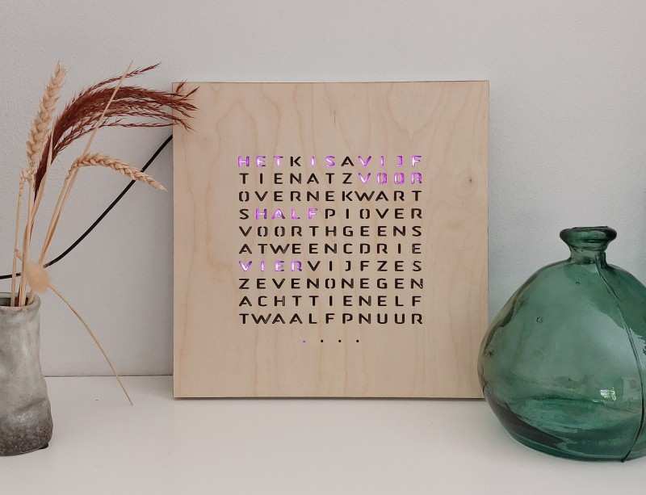
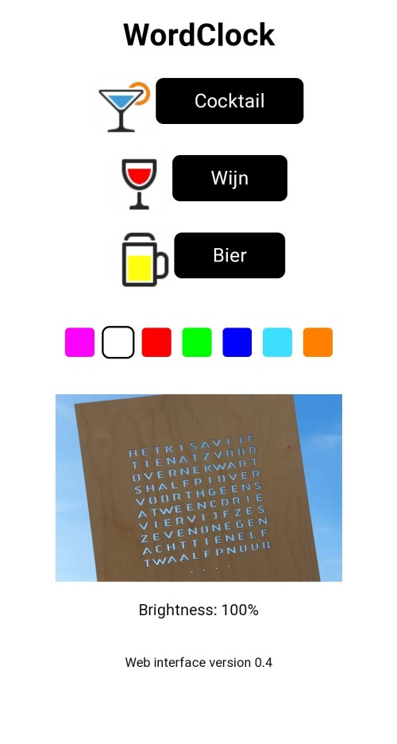

# Wordclock

This is the code for a wordclock which runs on an ESP32 with WiFi functionality. It uses the Arduino framework.
The code is written to work on a clock with a Dutch layout. For other languages the code (and the front plate of the clock) need to be adapted.

## Functions
- Display a word clock with words for every five minutes.
- Display one LED for each minute after the five minutes. So 19 past one would display as a quarter past one and four additional lights
- Synchronize with a time server at boot and every five minutes. This also ensure summer and winter time. (this may be considered a too often but did fix a few issues with incorrect times being shown)
- Change brightness depending on the brightness of the surroundings. Brightness is lower in a dark environment
- Run a webserver on a local network for the following functions:
  - Show current brightness level
  - Change color of the LEDs (startup always in default)
  - Display a glass of beer
  - Display a test pattern (for checking functions. This is a hidden effect, you need to change the url manually. So for insiders only)
  - Run animations
    - Filling wine glass
    - Filling cocktail glass
    - stroboscope effect (hidden effect)

# Remarks on the code
This is one large block of code of ~1000 lines. I think this is a good example of really poor coding practice. For example the LED layout for the animations is included in the main code. It can be drastically improved for readability and for the use of different languages. This is an improvemt which is currently not planned.

# Some images
The final clock. As mentioned, it is in Dutch. Also the design is the first prototype. Can be improved with, for example, a steel or glass plate. This in 3 mm plywood with laser cutted openings. Other improvements are in the design of structure behind the front plate, to allow more light to go outside and to prevent 'leakage' to other letters. 

This is the webinterface on a mobile device:

